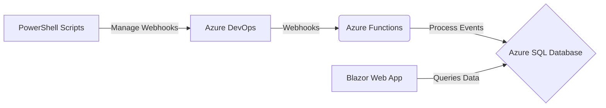

# azdo-deployview - Release Dashboard for Azure DevOps

[](https://github.com/dneimke/azdo-deployview/actions/workflows/ci.yml)

## Overview

**azdo-deployview** is a real-time release dashboard for Azure DevOps that provides a centralized view of
your deployment pipelines across multiple projects. Inspired by the Octopus Deploy dashboard,
azdo-deployview brings clarity to your CI/CD process, allowing you to quickly monitor deployment
statuses, track release versions, and identify bottlenecks. Built with Azure Functions, Azure SQL Database,
and a Blazor front-end, it leverages webhooks for instant updates and delivers a seamless, insightful
experience for developers and release managers.

## Goals

- **Centralized View:** A single pane of glass for all release pipelines
- **Real-time Deployment Status:** Display the current status of deployments (success, failure, in-progress, etc.)
- **Historical Data:** Provide a view of past deployment history
- **Filtering and Searching:** Enable filtering by project, environment, and searching for specific deployments
- **User-Friendly Interface:** Easy to navigate and understand

## Architecture

The solution uses Azure services and a Blazor web application:

1. **Azure DevOps Webhooks:** Trigger events when releases are created or deployment statuses change
2. **Azure Functions:** Serverless functions that receive and process webhook events
3. **Azure SQL Database:** Stores structured data about projects, releases, environments, and deployments
4. **Blazor Web Application:** Provides the user interface for the dashboard, displaying data from the Azure SQL Database
5. **PowerShell Helper Scripts:** Used to automate webhook management in Azure DevOps



## Data Model

The database schema consists of:

- **Projects:**

  - `project_id` (INT, Primary Key)
  - `project_name` (VARCHAR(255), Unique)
  - `project_group` (VARCHAR(255))

- **Environments:**

  - `environment_id` (INT, Primary Key)
  - `environment_name` (VARCHAR(255), Unique)

- **Releases:**

  - `release_id` (INT, Primary Key)
  - `project_id` (INT, Foreign Key)
  - `version` (VARCHAR(255))
  - `release_notes` (TEXT, Optional)
  - `created_time` (DATETIME)

- **Deployments:**
  - `deployment_id` (INT, Primary Key)
  - `release_id` (INT, Foreign Key)
  - `environment_id` (INT, Foreign Key)
  - `start_time` (DATETIME)
  - `end_time` (DATETIME)
  - `status` (VARCHAR(50))
  - `deployed_by` (VARCHAR(255), Optional)
  - `deployment_details` (TEXT, Optional)

## Webhook Events

The solution listens for the following Azure DevOps webhook events:

- `release created`
- `release deployment started`
- `release deployment completed`
- `release deployment approval pending` (Optional)
- `release deployment approval completed` (Optional)

## Technology Stack

- **Backend:**
  - Azure Functions (C#)
  - Azure SQL Database
- **Frontend:**
  - Blazor (Server or WebAssembly - to be determined)
- **Infrastructure:**
  - Azure DevOps
  - PowerShell
- **Development Environment:**
  - VS Code
  - Devcontainers

## Development Setup

1. **Prerequisites:**

- .NET SDK (latest)
- Azure Account
- Azure CLI
- Azure Functions Core Tools
- PowerShell 7+
- VS Code with the following extensions:
  - Remote - Containers
  - Azure Account
  - C#
  - Azure Functions
  - Azure Databases
  - Azure Resources
  - PowerShell

2. **Clone the Repository:**

   ```bash
   git clone https://github.com/dneimke/azdo-deployview.git
   ```

3. **Open in Devcontainer:**

- Open the project folder in VS Code.
- When prompted, choose "Reopen in Container." This will build the devcontainer and set up the development environment.

4. **Database Setup:**

- Create an Azure SQL Database instance.
- Use the provided scripts (e.g., `database/schema.sql`) to create the database schema.

5. **Azure Function Configuration:**

- Create an Azure Function App in your Azure subscription.
- Configure the Function App to use Managed Identities for authentication with Azure SQL Database.
- Set up application settings for the Function App:
  - `AzureWebJobsStorage` (connection string for Azure Storage)
  - `AzureSqlDatabaseConnectionString`
  - `AzureDevOpsOrgUrl` (URL of your Azure DevOps organization)
  - `AzureDevOpsPat` (Personal Access Token for managing webhooks - consider using a more secure method in production)

6. **Blazor App Configuration:**

- Configure the Blazor app to connect to your Azure SQL Database. Use Managed Identities for authentication.

7. **Webhook Setup:**

- Use the provided PowerShell helper scripts (e.g., `scripts/New-AzureDevOpsWebHook.ps1`) to register webhooks in your Azure DevOps projects.
- Ensure each webhook is configured with a secret for security verification.

## Security Considerations

- **Webhook Secrets:** Use a strong, randomly generated secret for each webhook. Verify the secret in your Azure Functions to ensure the authenticity of requests.
- **Managed Identities:** Use Managed Identities for Azure Functions and the Blazor app to authenticate with Azure SQL Database securely. Avoid storing connection strings or secrets directly in code.
- **Input Validation:** Sanitize all user inputs in the Blazor app to prevent SQL injection and other security vulnerabilities.
- **Principle of Least Privilege:** Grant only the necessary permissions to your Azure Functions and the Blazor app.
- **HTTPS:** Ensure that all communication between Azure DevOps and your Azure Functions is encrypted using HTTPS.
- **Authentication and Authorization:** Implement appropriate authentication and authorization mechanisms for the Blazor app to control access to the dashboard.

## Error Handling and Logging

- **Azure Functions:** Implement robust error handling in Azure Functions to catch exceptions, log errors (using Application Insights or other logging mechanisms), and potentially retry failed operations.
- **Dead-letter Queues:** Consider using a dead-letter queue to store webhook events that fail to process for later analysis and reprocessing.
- **Blazor App:** Implement appropriate error handling and logging in the Blazor app to provide a good user experience and help with debugging.
- **Monitoring:** Use Azure Monitor and Application Insights to monitor the performance and health of your Azure Functions and Blazor app.

## Deployment

- **CI/CD:** Use Azure Pipelines or GitHub Actions to set up a continuous integration and continuous delivery (CI/CD) pipeline.
- **Infrastructure as Code (IaC):** Use ARM templates, Bicep, or Terraform to define your infrastructure as code. This enables you to manage and deploy your Azure resources (Function App, SQL Database, etc.) in a repeatable and automated way.
- **Deployment Steps:**
  1. Build and publish the Azure Functions.
  2. Build and publish the Blazor web application.
  3. Deploy the Azure resources using your IaC templates.
  4. Deploy the Azure Functions.
  5. Deploy the Blazor web application.

## Future Enhancements

- **Alerting:** Implement alerts based on deployment failures or delays (e.g., send notifications to Slack, Teams, or email).
- **Filtering by Release Definition:** Add the ability to filter deployments by specific release definitions.
- **Improved UI/UX:** Enhance the dashboard's user interface with more advanced features like charts, graphs, and interactive elements.
- **Role-Based Access Control:** Implement role-based access control to restrict access to certain features or data based on user roles.

## Contributing

Contributions to this project are welcome! Please follow the guidelines in our [Contributing Guide](CONTRIBUTING.md) when submitting pull requests.

## License

This project is licensed under the MIT License. See [LICENSE](LICENSE) for details.
